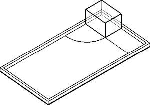
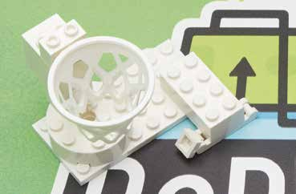
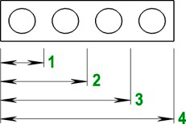
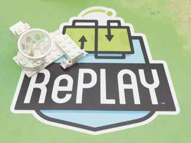
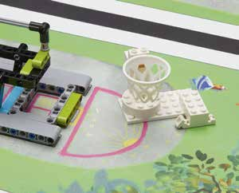
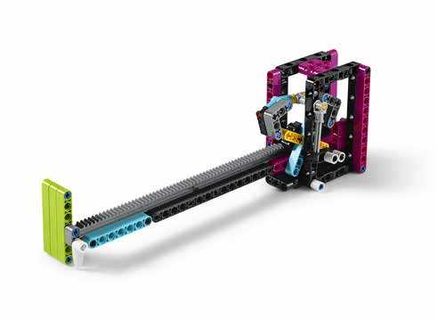

# FLL2020 Missions

Here you'll find the _same_ description for every FLL mission as in the newest handbook, available here: https://firstinspiresst01.blob.core.windows.net/first-game-changers/fll-challenge/FLL-Challenge-RGR-Final-ONA.pdf?fbclid=IwAR0ciFW4XTLxX3fos_1igTqqYPhPwnLRtJe2lcAcwjSaOUXIr-eBfhgiXj4

# `MXX`: Mission name

[_Picture of mission here_]

`Basic description of each mission`

<u>Not used for scroring.</u>

- Regular black text under the mission description lists the main requirements: `XX` points
- If the referee sees these things performed or completed: `XX` points as described

# `M00`: Equipment Inspection Bonus

`“Doing the same
with less” can save
time and space.`

- If all your equipment fits in the small inspection space: `25`

_When you get to each match, remove all your equipment from any containers and show the referee you can fit it all in the small
inspection space. See Rule 09 for details._

# `M01`: Innovation project

`The robot moves
your Innovation
Project onto the
RePLAY logo or the
gray area around
the bench (M04).`

If your Innovation Project:
- Is made of at least two white LEGO pieces
- Measures at least as long as four LEGO studs in at
least one direction
- Has any part of it touching either the RePLAY logo or
the gray area around the bench: `20` max

_Build and bring a single model that represents your solution
to the Innovation Project. The one shown here is just an
example. CAUTION: Your Innovation Project counts as
equipment. Building of your Innovation Project model is
suggested in Session 9 in the Engineering Notebook. Read
rule R01 and all the rules carefully and often so you can avoid
surprises at competitions._

|  |  |  |
|---|---|---|
| 4 stud measure | `20` | `20` |

# `M02`: Step Counter

