# RePlay rules and stuff

I created a markdown document from the LEGO pdf.. because it's more readable.

# Field Setup

The field consists of mission models on a mat surrounded by border walls. The mat and LEGO® pieces for building the mission models are in your Challenge set. The links and instructions needed for building and arranging everything are here.

## Mission model building

The robot interacts with mission models on the field
for points. The mission models are built in Sessions
1-4 in the Engineering Notebook. To build the mission
models (models), use the LEGO pieces from your
Challenge set and instructions from firstlegoleague.
org/missionmodelbuildinginstructions. It would take
one person about six hours to build all the models.
Models need to be built perfectly. “Almost perfect”
is not good enough. If you practice with incorrect
models, the robot will have problems at competitions.
Best practice is for at least two people to check each
other as they build.

## Field mat placement

- *STEP 1* – Check the table surface for bumps. Sand or
file them away and then vacuum well.

- *STEP 2* – On the vacuumed table only, unroll and
place the mat as shown below. Never fold the mat,
and never crush or bend a rolled mat.

- *STEP 3* – Slide the mat against the south and east
border walls. When table size and mat placement are
correct, the area west of the mat measures about
X = 13.5 by Y = 45 in. (343 mm by 1,143 mm).

- *STEP 4* – Optional – To hold the mat in place, you can
use thin strips of black tape, covering only the mat’s
east/west black borders

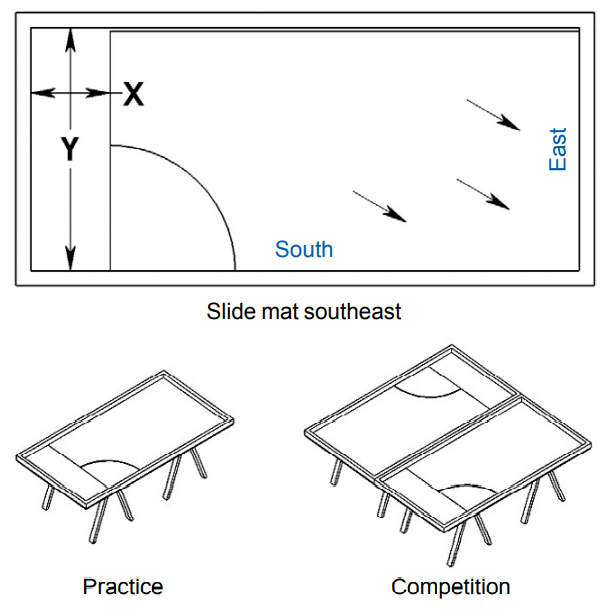

## Dual lock

Find the tan sheets of this reclosable fastening
material from 3M™ in your challenge set.
SECURING MODELS – “X” squares show where to
Dual Lock models to the mat. Use the Dual Lock as in
this example and be very exact.

__SECURING MODELS__ – “X” squares show where to
Dual Lock models to the mat. Use the Dual Lock as in
this example and be very exact.

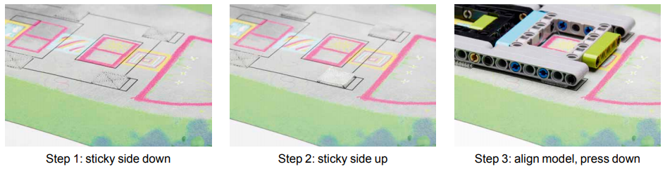

__MODEL STRESS__ – When pressing a model down, press on its lowest solid base instead of crushing the whole
model. Lift that same part if you need to separate the model from the mat.

## Mission model placement

__LOOSE MODELS__ – Place loose models as described or shown here. Models outside home need to be placed
exactly within their outline marks and aligned with any directional marks.

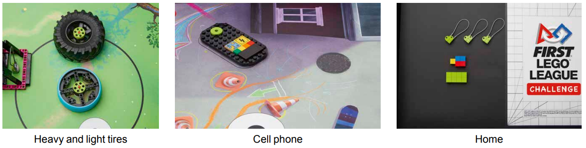

__HOME__ – Anywhere in home, place: 3 health units, 1 yellow cube, 2 red cubes, 2 blue cubes, 8 green cubes, and
your Innovation Project (not shown here).

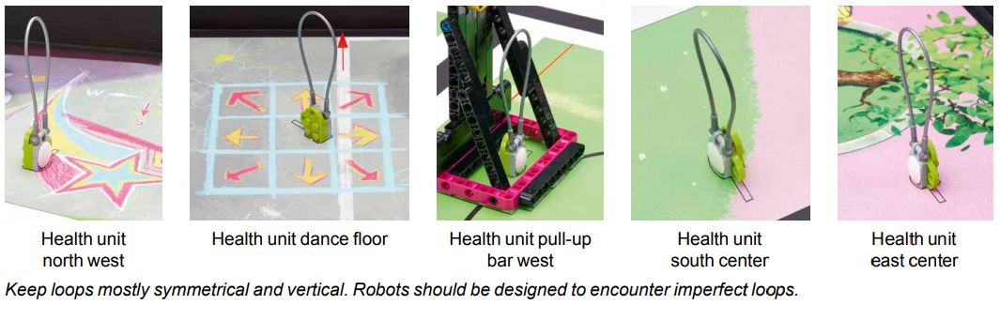

## Secured models

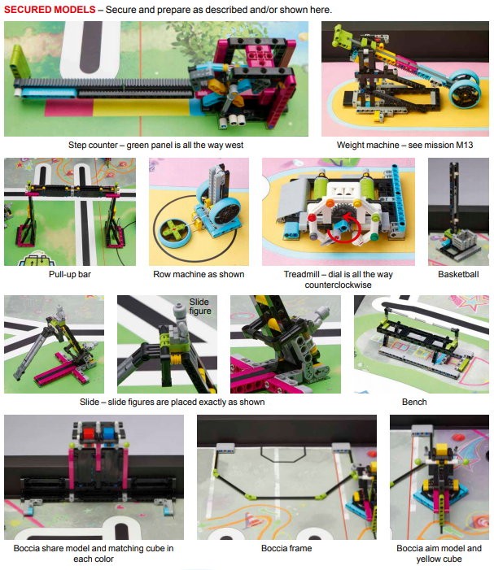

## Robot Game

- The team will build a robot using LEGO® elements
and technology. They program it to autonomously
complete a series of missions in a 2.5-minute Robot
Game to score points. The robot starts in the launch
area, tries missions in the order chosen by the team,
and then returns anywhere into home.

- The team can modify the robot when it is in home
before launching it again. If needed, the robot can
be brought home by hand, but the team will lose a
precision token. The team will play several matches
but only the highest score matters.

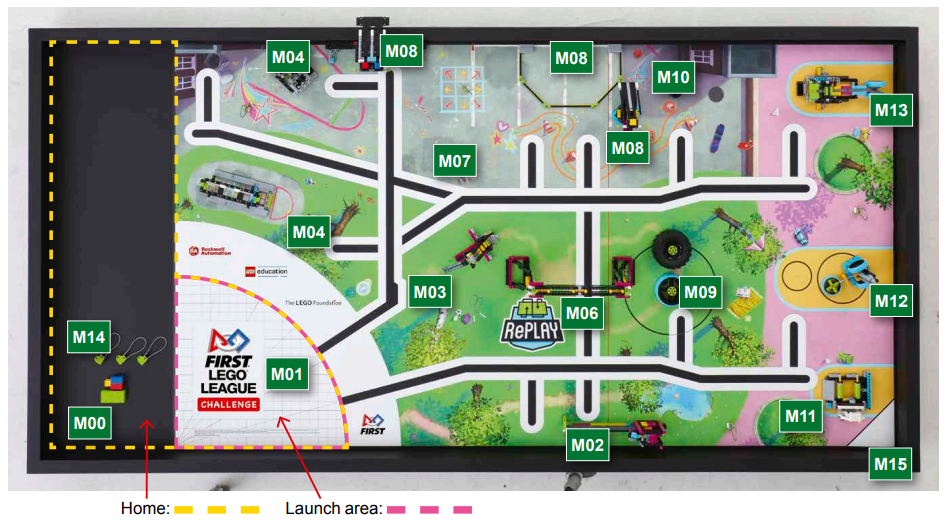

# Missions

## `M00:` __Equipment Inspection Bonus__

`Doing the same with less` can save time and space.

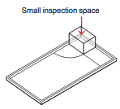

• If all your equipment fits in the small inspection space: `25`

_When you get to each match, remove all your equipment from any containers and show the referee you can fit it all in the small
inspection space. See Rule 09 for details._

## `M01:` __Innovation project__

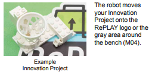

If your Innovation Project:
* Is made of at least two white LEGO pieces
* Measures at least as long as four LEGO studs in at
least one direction
* Has any part of it touching either the RePLAY logo or
the gray area around the bench: `20` max

_Build and bring a single model that represents your solution
to the Innovation Project. The one shown here is just an
example. CAUTION: Your Innovation Project counts as
equipment. Building of your Innovation Project model is
suggested in Session 9 in the Engineering Notebook. Read
rule R01 and all the rules carefully and often so you can avoid
surprises at competitions._

## `M02:` __Step Counter__

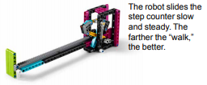

If the bottom of the pointer is on magenta: `10`, yellow: `15`, blue: `20`.

Example pointer positions:

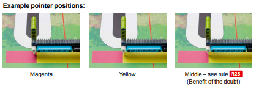

## `M03:` __Slide__

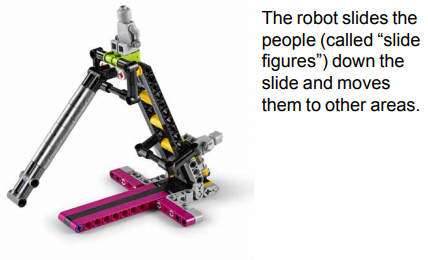

- If only one slide figure is off the slide: `5`
- If both slide figures are off the slide: `20`
- If a slide figure is completely in home: `10 max`
- If a slide figure is held completely off the mat by the
heavy tire and is touching nothing else: `20 max`

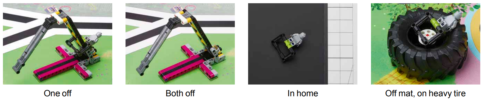

_“Off the slide” scores if the slide figure’s black frame is past/
below the tip of the slide’s gray slide part. Notice the score for
two slide figures off is 20, not 25._

## `M04:` __Bench__

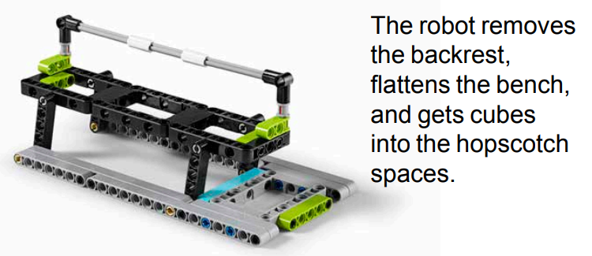

- If the bench is down flat: `10`
- If the bench is down flat and there are cubes touching the mat in hopscotch spaces: `10` each ___space___
- If the backrest is completely out of both of its holes: `15`

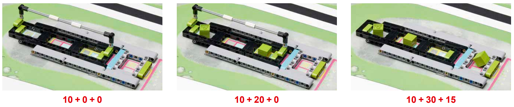

## `M05:` __Basketball__

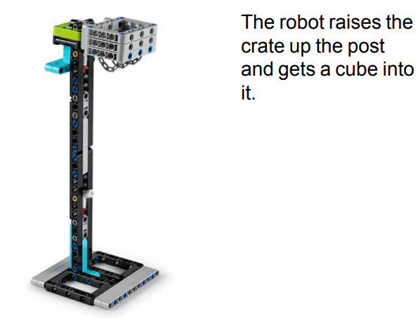

- If there is a cube in the crate: `15`
- If the crate rests on the middle height’s white
stopper: `15`
- If the crate rests on the top height’s white stopper:
`25`

_Only one cube can score in the crate. Score top height or
middle height, not both._

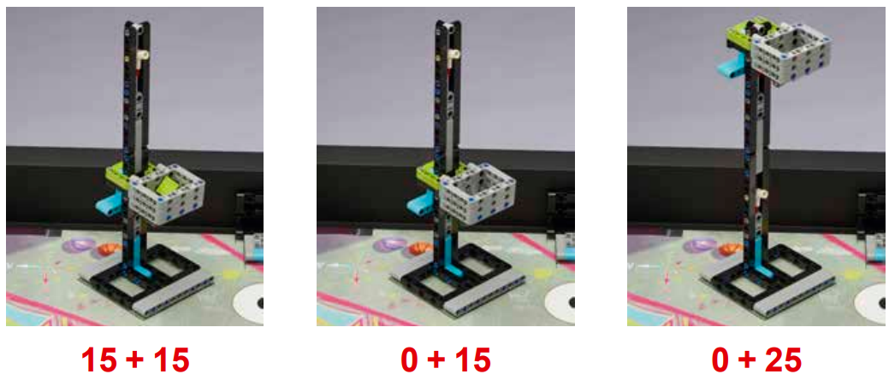

## `M06:` __Pull-up bar__

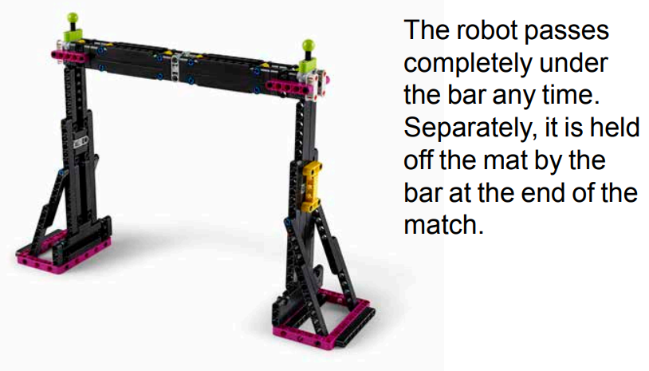

- If the robot passes completely through the pull-up
bar’s upright frame at any time: 15 max
- If the pull-up bar holds 100% of the robot up off the
mat at the end of the match: 30

_A “pass through” can score northward or southward, but
only one way and only one time. A “pass through” scores at
the time it happens. This is a rule R22 exception._

_For the “held up” score, you cannot score this and M07 in
the same match._

## `M07:` __Robot dance__

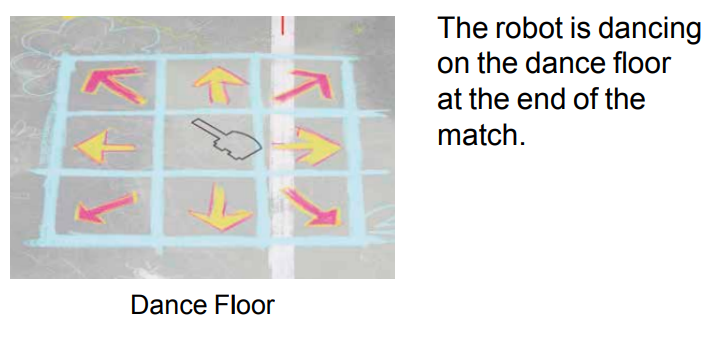

- If the robot’s controller is at least partly over the dance floor in a “dancing” motion at the end of the match: `20`

_Any silly or skilled repetitive action counts as dancing – do something fun! For M07, you cannot score this plus the “held up”
score from M06 in the same match._

## `M08:` __'Boccia'__

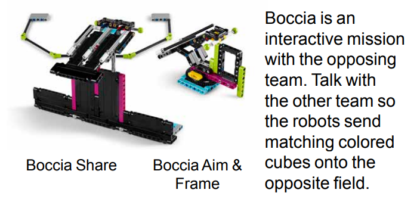

- If both share models have sent only one cube
anywhere onto the opposing field and those cubes
color-match each other: `25` __for each team__
- If there are cubes completely in your frame or
target: `5` __each cube__
- If there is at least one yellow cube completely in
your target: `10` __added__

_If there is equipment even partly in your frame, M08 scores
zero for you (the opposing team is not affected)._

_If, like most teams, you have only your one practice table,
your sent cube will simply go over your north wall during
practice._

_(Study the scoring examples as if both share models did
share only one cube.)_

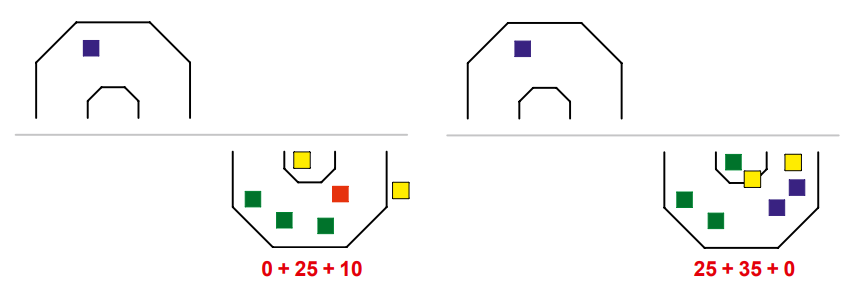

## `M09:` __Tire Flip__

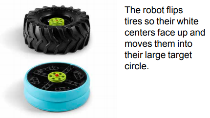

- If the light (blue tread) tire is white center up: `10`
- If the heavy (black tread) tire is white center up: `15`
- If white-center-up tires are completely in the large target circle: `5` __each__
- For all scores, the tire needs to be resting on only the mat.

_If the heavy tire crosses the red flip line at any time, even partly, it scores zero.
The flip line runs all the way north to south. Only part of it is shown._

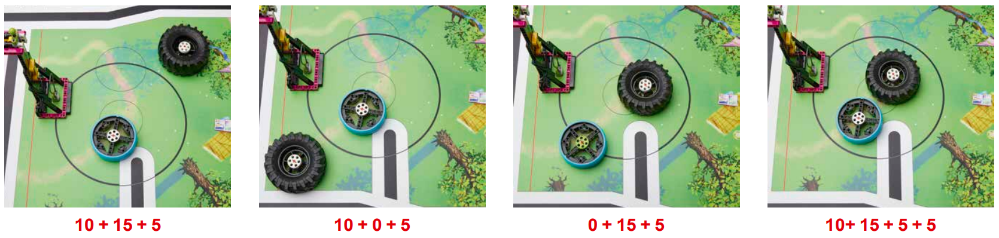

## `M10:` __Cellphone__

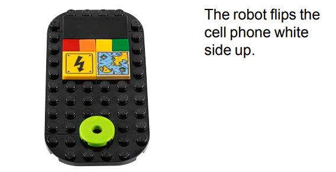

- If the cell phone is white side up and resting on only the mat: `15`